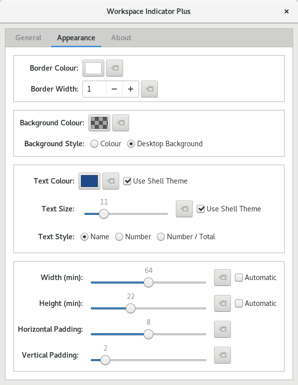

# About
Workspace Indicator Plus is a comprehensive rewrite of the stock workspace indicator extension for Gnome Shell. All existing functionality has been kept, and a comprehensive range of customisation options have been included for the panel display. On top of this there are plans for workspace previews in the workspace selection menu, similar to the stock overview screen, and rebindable click actions for a variety of workspace switching options.

*More previews comming soon*

# Installation
This extension is currently under heavy development, and is not guaranteed to be 100% stable on any given release. That said, if you wish to try out the extension and provide feedback or bug reports it would be really helpful.

Installation is more or less like installing any other extension from source:
1. git clone `https://github.com/tomha/gnome-shell-extension-workspace-indicator-plus workspace-indicator-plus@tomha.github.com` (The destination folder name is important).
2. `cp -r workspace-indicator-plus@tomha.github.com ~/.local/share/gnome-shell/extensions/ (Or clone directly to this location).
3. Restart the Gnome Shell.
  - Under Xorg press ALT + F2, type r, and press ENTER.
  - Under Wayland log out and back in again.
4. Activate via your preferred method such as Gnome Tweak Tools, or the command `gnome-shell-extension-tool -e workspace-indicator-plus@tomha.github.com`.
